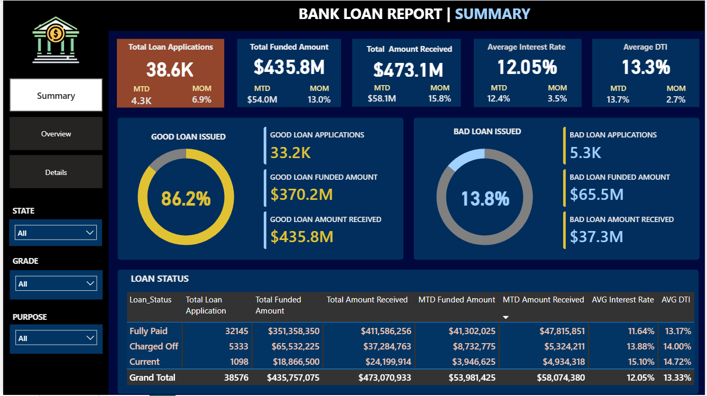
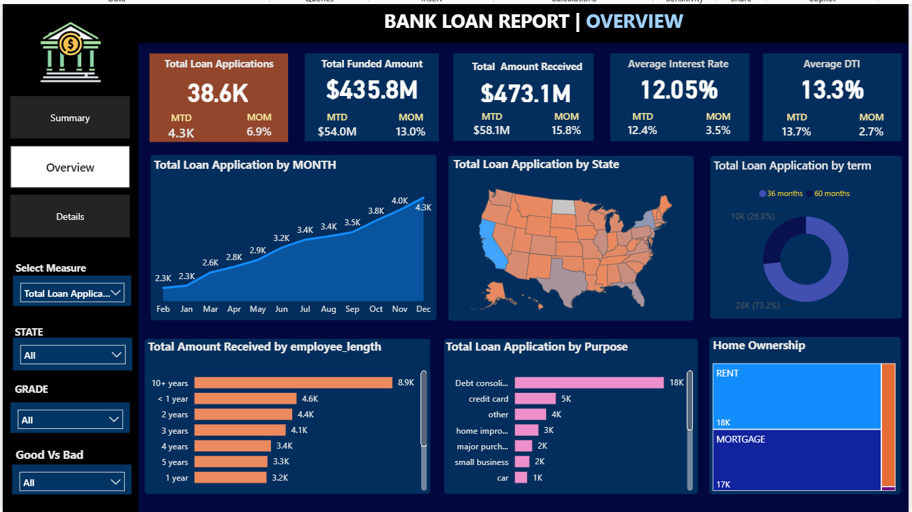
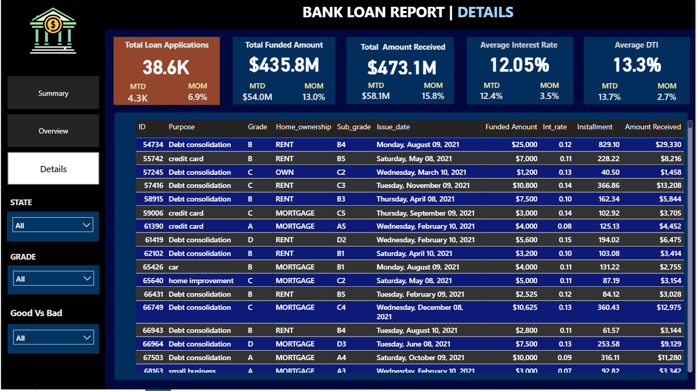

# 🏦 Bank Loan Portfolio Analysis | SQL + Power BI

An end-to-end analytics project that helps a bank monitor lending activity, track loan portfolio health, and distinguish **Good Loans** from **Bad Loans** — built using **SQL** for KPI extraction/validation and **Power BI** for interactive dashboards.

---

## 📌 Problem Statement

In order to monitor and assess the bank's lending activities and performance, this project builds a comprehensive Bank Loan Report. It provides insights into key loan-related metrics and how they change over time — helping track the loan portfolio's health, support data-driven lending decisions, and surface trends that inform lending strategy.

The report is split into three dashboards:
1. **Summary** — high-level KPIs and loan status breakdown
2. **Overview** — trends and breakdowns across time, geography, and borrower attributes
3. **Details** — loan-level grid view for granular exploration

---

## 🎯 Objectives

- What's the total loan volume, funded amount, and amount received — and how do they trend **Month-to-Date (MTD)** vs the **previous month (MoM)**?
- What's the average **interest rate** and **Debt-to-Income Ratio (DTI)** across the portfolio?
- What percentage of loans are **Good Loans** (`Fully Paid` / `Current`) vs **Bad Loans** (`Charged Off`)?
- How does lending performance vary by **state**, **loan term**, **employment length**, **loan purpose**, and **home ownership**?

---

## 🗂️ Dataset

- **Source file:** `data/financial_loan_data_excel.xlsx`
- **Key fields:** `id`, `issue_date`, `loan_amount`, `int_rate`, `dti`, `loan_status`, `total_payment`, `term`, `emp_length`, `purpose`, `home_ownership`, `address_state`
- **Analysis period:** MTD = December 2021, PMTD = November 2021

---

## 🛠️ Tech Stack

| Tool | Purpose |
|---|---|
| **SQL Server** | KPI calculation, data validation, aggregate queries |
| **Power BI** | Data modeling, DAX measures, interactive dashboards |
| **Excel** | Raw source data |

---

## 📊 Dashboards

### 1. Summary
KPI cards for Total Loan Applications, Total Funded Amount, Total Amount Received, Average Interest Rate, and Average DTI — each with MTD and MoM comparisons. Includes a Good Loan vs Bad Loan breakdown and a loan status grid view.



### 2. Overview
- **Monthly Trends by Issue Date** — Line chart
- **Regional Analysis by State** — Filled map
- **Loan Term Analysis** — Donut chart
- **Employee Length Analysis** — Bar chart
- **Loan Purpose Breakdown** — Bar chart
- **Home Ownership Analysis** — Tree map



### 3. Details
A consolidated grid view offering loan-level granularity across all key fields — borrower profile, loan terms, and performance metrics in one place.



---

## 💡 Key Insights

- 86.2 % of loans are classified as **Good Loans**, funding $ 370.2M in total.
- **[State]** leads in total loan volume and amount received.
- **Debt consolidation** is the top-stated loan purpose by application count.
- Borrowers with **10+ years** of employment history account for the largest share of funded amount.

---

## 🧮 SQL Queries

All KPI and breakdown queries are in [`sql/Bank_Loan_Query.sql`](sql/Bank_Loan_Query.sql), including:
- Total / MTD / PMTD loan applications, funded amount, amount received
- Average interest rate and DTI (overall, MTD, PMTD)
- Good Loan vs Bad Loan metrics (count, percentage, funded amount, received amount)
- Breakdowns by loan status, month, state, term, employment length, purpose, and home ownership

---

## 📁 Folder Structure

```
bank-loan-report-powerbi/
├── README.md
├── data/
│   └── financial_loan_data_excel.xlsx
├── sql/
│   └── Bank_Loan_Query.sql
├── powerbi/
│   └── BANK_LOAN.pbix
├── docs/
│   └── Problem_Statement.docx
└── screenshots/
    ├── dashboard1_summary.png
    ├── dashboard2_overview.png
    └── dashboard3_details.png
```

**Gaurav Mishra**
[LinkedIn](www.linkedin.com/in/gaurav-mishra-406881224) 
